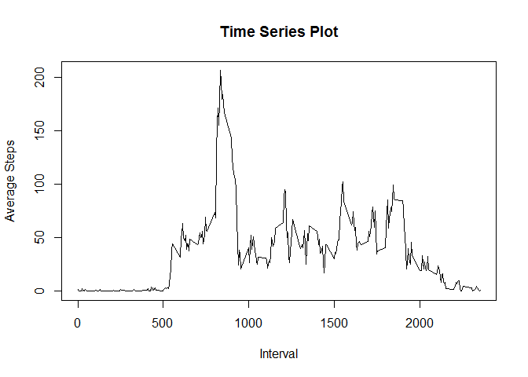
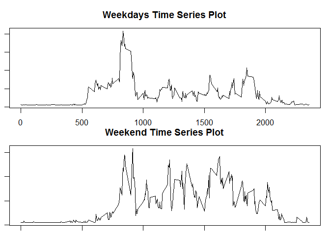

# Reproducible Research: Peer Assessment 1


## Loading and preprocessing the data


```r
activity<-read.csv("activity.csv") #Load Data
#Transform data into a format suitable for analysis 
activity$steps<-as.numeric(activity$steps) 
activity$interval<-as.numeric(activity$interval)
activity$date<-as.Date(activity$date)
activitydummy<-activity #Just a placeholder of original data
total<-tapply(activity$steps, activity$date, sum, na.rm=TRUE) #Subset data without NA
```


## What is mean total number of steps taken per day?


```r
meantotal<-mean(total)
meantotal
```

```
## [1] 9354.23
```

```r
mediantotal<-median(total)
mediantotal
```

```
## [1] 10395
```


## What is the average daily activity pattern?


```r
intsteps<-tapply(activity$steps, activity$interval, mean, na.rm=TRUE, type="l")
plot(intsteps~as.numeric(names(intsteps)), type="l", xlab="Interval", ylab="Average Steps", main="Time Series Plot") #Plotting #1
```

 


## Imputing missing values
Will copy over the original dataset, then replace the missing values with a mean

```r
activitydummy$steps[is.na(activitydummy$steps)]<-mean(na.exclude(activity$steps))
```

## Are there differences in activity patterns between weekdays and weekends?

Yes


```r
weekdays1 <- c('Monday', 'Tuesday', 'Wednesday', 'Thursday', 'Friday')
dayindex<-factor((weekdays(activitydummy$date) %in% weekdays1),levels=c(FALSE, TRUE), labels=c('weekend', 'weekday'))
wkdaysteps<-tapply(activitydummy$steps[dayindex=="weekday"], activitydummy$interval[dayindex=="weekday"], mean, na.rm=TRUE, type="l")
wkendsteps<-tapply(activitydummy$steps[dayindex=="weekend"], activitydummy$interval[dayindex=="weekend"], mean, na.rm=TRUE, type="l")
par(mfcol=c(2,1))
par(mar=c(1,1,3,1))
plot(wkdaysteps~as.numeric(names(wkdaysteps)), type="l", xlab="Interval", ylab="Number of Steps", main="Weekdays Time Series Plot") #Plotting Weekday Steps
plot(wkendsteps~as.numeric(names(wkendsteps)), type="l", xlab="Interval", ylab="Number of Steps", main="Weekend Time Series Plot") #Plotting Weekend Steps
```

 


